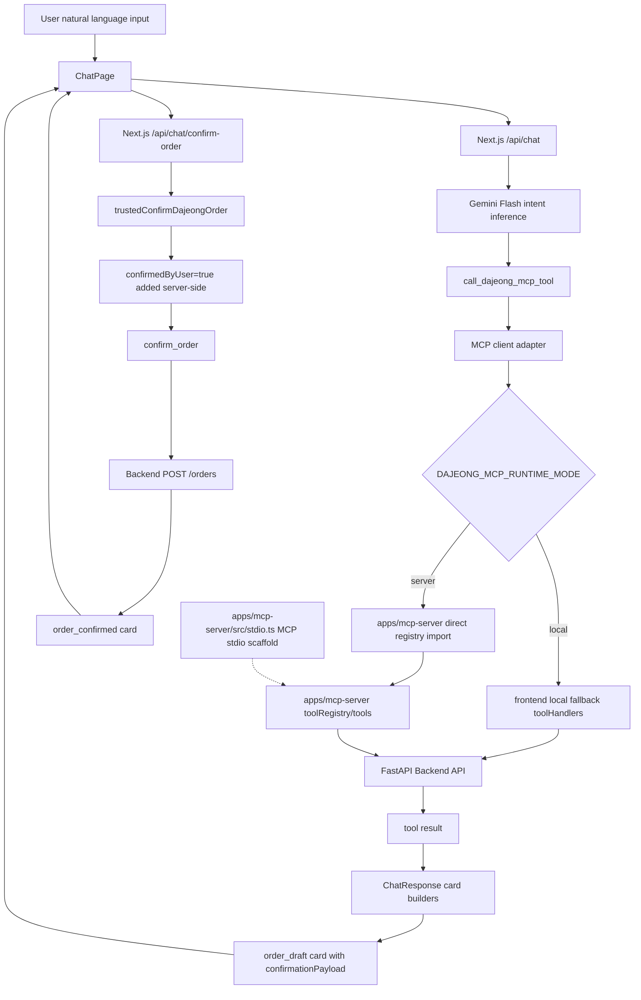

# MVP Architecture

This document describes the current Phase 5G architecture. It is intentionally limited to the implemented MVP flow and does not describe planned frontend MCP transport client behavior as if it already exists.

## Current Architecture Diagram



## ChatPage Path

ChatPage is the user-facing AI transaction screen. For the AI transaction path it calls:

- `/api/chat` for natural-language messages
- `/api/chat/confirm-order` for trusted draft confirmation

ChatPage must not call Backend API directly for the AI transaction flow. It must not add `confirmedByUser=true`; that flag is added only on the server-side trusted confirmation path.

## `/api/chat` Path

`/api/chat` receives a natural-language message and calls `runDajeongGeminiChat`.

The chat runner:

1. configures Gemini Flash
2. exposes the `call_dajeong_mcp_tool` gateway function
3. captures tool results
4. converts relevant tool results into Dajeong `ChatResponse` cards

Gemini can use the gateway for:

- `get_companies`
- `get_company_menus`
- `search_menu`
- `create_order_draft`

Gemini cannot directly execute `confirm_order`. The adapter rejects `confirm_order` through the Gemini gateway.

## MCP Client Adapter

`apps/frontend/src/lib/gemini/mcpClientAdapter.ts` is the boundary between Gemini function calls and tool execution.

It supports two modes:

- `local`: calls frontend local fallback `toolHandlers`
- `server`: calls `callDajeongMcpServerTool` through monorepo direct registry import

The `server` mode is server mode direct registry import, not MCP transport.

## Local Mode Path

Local mode is the default:

```text
/api/chat
-> Gemini
-> call_dajeong_mcp_tool
-> mcpClientAdapter
-> frontend local fallback toolHandlers
-> Backend API
```

This mode remains functional and is not removed in Phase 5G.

## Server Direct Registry Path

Server mode:

```text
/api/chat
-> Gemini
-> call_dajeong_mcp_tool
-> mcpClientAdapter
-> apps/mcp-server/src/index.ts
-> callDajeongMcpServerTool
-> toolRegistry
-> apps/mcp-server/src/tools/*
-> Backend API
```

`apps/mcp-server/src/index.ts` exports registry APIs only. Importing it does not start stdio transport.

## Trusted Confirmation Path

The approval path is separate from the Gemini gateway:

```text
order_draft card
-> user confirm action
-> ChatPage
-> /api/chat/confirm-order
-> trustedConfirmDajeongOrder
-> confirmedByUser=true added server-side
-> confirm_order
-> Backend POST /orders
-> order_confirmed card
```

This is the only path where `confirm_order` is allowed. It protects the MVP from direct LLM-triggered order creation.

## MCP Stdio Scaffold

`apps/mcp-server/src/stdio.ts` is a standalone runtime entrypoint:

```text
node dist/stdio.js
-> createDajeongMcpStdioServer
-> StdioServerTransport
-> mcpServer handlers
-> callDajeongMcpServerTool
```

The stdio scaffold is present for future MCP clients. The frontend does not use it in Phase 5G.

## Runtime Status

Implemented:

- `/api/chat` Gemini gateway orchestration
- local fallback tool execution
- server mode direct registry import
- trusted `/api/chat/confirm-order`
- server-side `confirmedByUser=true`
- `confirm_order` gateway block
- standalone MCP stdio scaffold

Pending:

- frontend MCP transport client
- local fallback removal
- draft persistence and idempotency
- production auth/session
- payment and external service integrations
